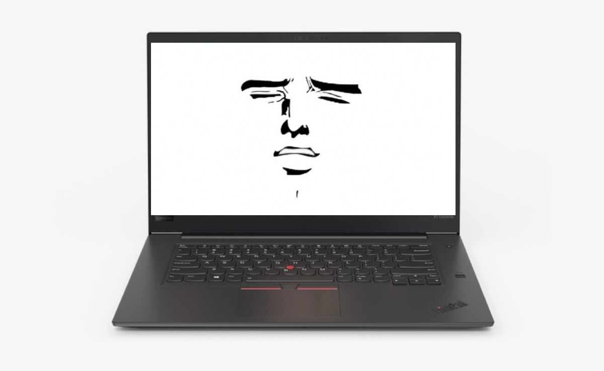



# nubmoan

Source code for nubmoan, the program that makes your ThinkPad TrackPoint (the red nub) moan when you press it.

Record your own moans and include them in the `/moanswav` folder in increasing intensity from 1-10 as `file1.wav` `file2.wav` and so on.

Change line 110 in `mouse_tracker_2.c` to match your own absolute moan folder path.

Compile with `gcc -o mouse_tracker_2 mouse_tracker_2.c -lwinmm -lgdi32` iirc.

---

## Linux

To run on Linux:

1. **List Input Devices**:  
   First, you need to find the path of the input device (e.g., TrackPoint).
   - Compile the device listing program:  
     `g++ -Wall -g -o list_input_devices list_input_devices.c`

   - Run the compiled binary with `sudo`:  
     `sudo ./list_input_devices`

   - Note the device path of the input device you want to monitor (e.g., for the TrackPoint, it might be `/dev/input/event13`).

2. **Create the Moans Folder**:  
   Create the `moanswav` folder in your project directory and add `1.wav`, `2.wav`, ..., `10.wav` inside it.

3. **Modify the Device Path**:  
   Modify the `linux_nubmoan.c` file in your project to use the device path you found in the previous step (e.g., `/dev/input/event13`).

4. **Compile the Program**:  
   Compile the `linux-nubmoan` program:  
   `g++ -Wall -g -lm -pthread -o linux-nubmoan linux_nubmoan.c`

5. **Granting permissions**:  
   Grant `linux-nubmoan` file permission to read from `/dev/input` without sudo, not including full root access:  
   `sudo setcap 'cap_dac_read_search,cap_sys_admin+ep' ./linux-nubmoan`

6. **Run the Program**:  
   `./linux-nubmoan`
